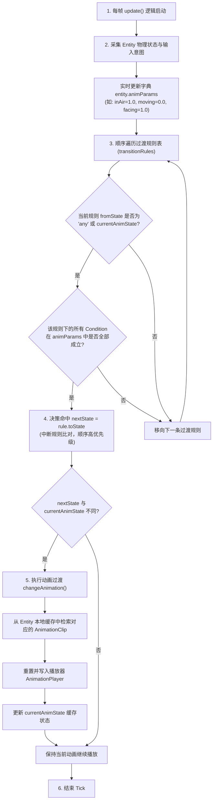

# Animator 无状态数据驱动动画机运作机制

这是针对当前项目中重构后的数据驱动动画切换系统（[Animator](file:///c:/Users/lpy16/OneDrive/Desktop/c++/GraphAndObjTest/graphAndObjectTest/Animator.h)）的原理与数据流动流程的详细解析文档。

---

## 1. 核心设计思想

这套系统的核心思路是 **“逻辑与表现完全解耦，状态决策完全数据化”**：
1. **Animator 自身无状态**：C++ 代码中没有任何 hardcode（硬编码）的逻辑切换判断（如 `if (inAir) changeTo(jump)`）。它只提供一个通用的参数收集和条件比对框架。
2. **状态与规则完全数据化**：所有的动画状态命名（如 `walk_r`）、动画片段物理文件映射（如 `player1_walk_r`）以及切换路径与条件，全部配置在外部的 JSON 文件 [entity_templates.json](file:///c:/Users/lpy16/OneDrive/Desktop/c++/GraphAndObjTest/graphAndObjectTest/assets/data/entity_templates.json) 中。
3. **动态统一切换判定**：所有实体（无论是玩家还是怪物）在运行时都将自身的物理状态和操作意图统一收集进 `entity.animParams` 键值字典中，由 Animator 统一对表进行命中判定。

---

## 2. 每帧运作机制流程图

---

## 3. 具体执行阶段详解

### 第一阶段：状态采集 (Update Dictionary)
每一帧，[Animator::update](file:///c:/Users/lpy16/OneDrive/Desktop/c++/GraphAndObjTest/graphAndObjectTest/Animator.cpp#L35) 会读取宿主 `Entity` 的当前状况，将浮点类型的变量写入 `entity.animParams` 映射表中：
* `inAir` / `onGround` / `sprinting` / `isJumping`：实体的空间物理状态。
* `facing`：朝向（`1.0` 代表右，`-1.0` 代表左）。
* `animFinished`：当前 `AnimationPlayer` 中的当前剪辑是否播放完毕。
* `justLanded`：是否在此帧刚刚落地（由前一帧的 `lastInAirState` 联合本帧的 `onGround` 算出）。
* `shouldPlayJumpStart`：是否是按下跳跃键起跳的第一帧。

### 第二阶段：规则过滤与比对 (Filter & Match)
Animator 顺序读取从 JSON 载入的 `transitionRules` 过渡规则表：
1. **源状态比对**：只有规则的 `from` 字段是当前状态 `currentAnimState` 或者 `"any"` 时，才进行条件检查。
2. **条件判定**：对于该条规则声明的所有条件（如要求 `inAir == 1.0` 且 `facing == 1.0`），如果全都匹配，说明该规则成立。
3. **高优先级命中**：一旦第一条条件完全符合的规则被匹配成功，则立即将 `nextState` 修改为该规则的 `to` 状态，并**直接 break（退出循环）**。

### 第三阶段：切换应用 (Change Clip)
* 若比对出的 `nextState` 与 `currentAnimState` 相同，则维持现状，不做任何处理。
* 若不相同，则调用 [Animator::changeAnimation](file:///c:/Users/lpy16/OneDrive/Desktop/c++/GraphAndObjTest/graphAndObjectTest/Animator.cpp#L15)：
  1. 通过新状态名从实体缓存中找到对应的 `AnimationClip`。
  2. 提交给实体的动画播放器进行片段重置与切片播放。
  3. 将 `currentAnimState` 记录更新为新状态，用于下一帧的 `from` 过滤判定。

---

## 4. 实例分析：玩家诞生、下落、落地、硬直、起立全过程

在玩家从空中诞生，经历下落、落地、缓冲到最后站立的过程中，这套无状态动画系统的运转细节如下：

| 游戏阶段 | 逻辑状态特征 | 命中规则 (FROM -> TO) | 条件判定细节 | 最终动画表现状态 (`currentAnimState`) |
| :--- | :--- | :--- | :--- | :--- |
| **1. 诞生初始帧** | 刚刚在空中出生 | 无 (初始绑定) | 系统调用 `initAnimation` 强制绑定配置的 `initialAnim` | `idle_r` |
| **2. 下坠阶段** | `inAir = 1.0` `isJumpStart = 0.0` `facing = 1.0` | `any` -> `jump_loop_r` | `inAir(1.0) == 1.0` `isJumpStart(0.0) == 0.0` `facing(1.0) == 1.0` | `jump_loop_r` (下落循环动画) |
| **3. 落地瞬间帧** | `onGround = 1.0` `justLanded = 1.0` `moving = 0.0` `facing = 1.0` | `jump_loop_r` -> `jump_end_r` | `justLanded(1.0) == 1.0` `moving(0.0) == 0.0` `facing(1.0) == 1.0` | `jump_end_r` (落地硬直缓冲) |
| **4. 硬直播放中** | `onGround = 1.0` `justLanded = 0.0` `animFinished = 0.0` | 无匹配规则 | 因为 `animFinished` 还是 0.0，不满足跳出条件 | 维持播放 `jump_end_r` |
| **5. 播放完起立** | `onGround = 1.0` `animFinished = 1.0` | `jump_end_r` -> `idle_r` | 缓冲动画播到了最后一帧，满足 `animFinished(1.0) == 1.0` | `idle_r` (回归站立怠速) |
